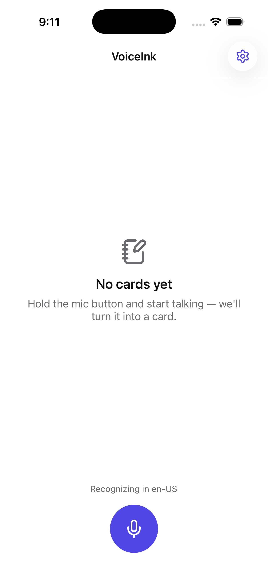
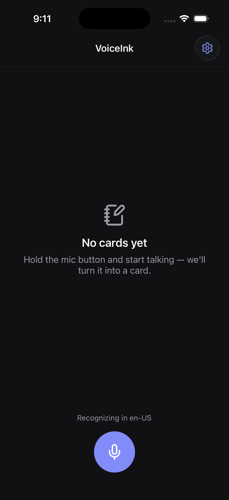
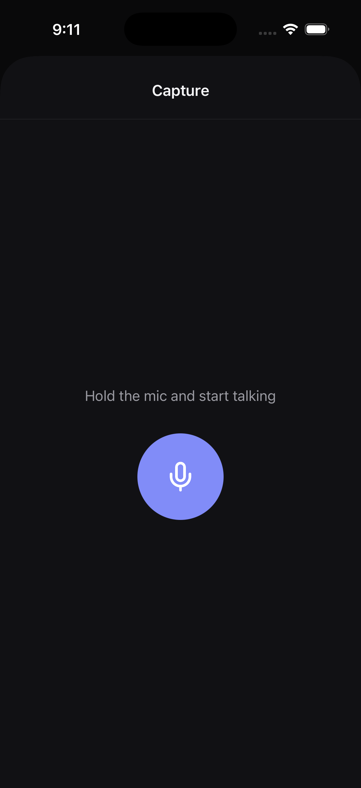
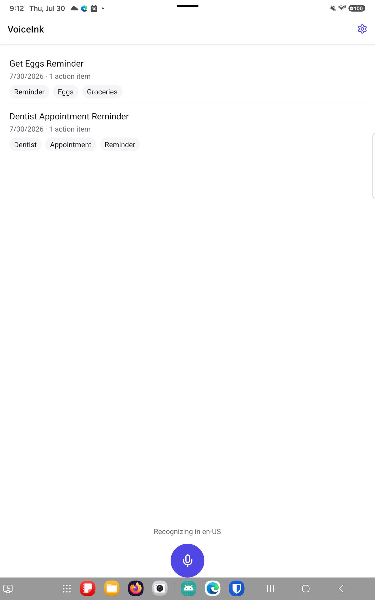
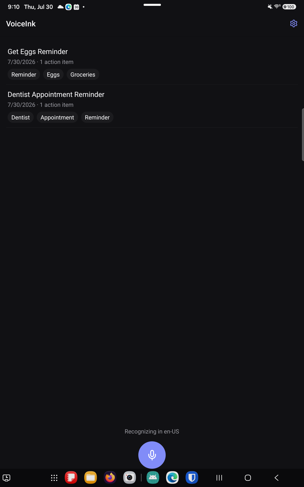
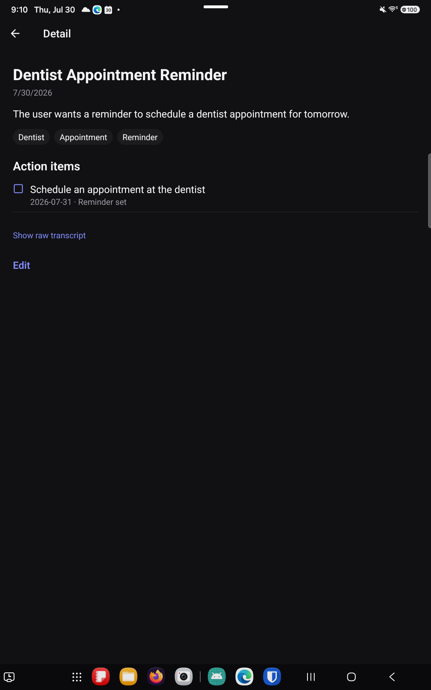

# VoiceInk

Hold a button, ramble, release — get back a clean, structured, editable note card.

VoiceInk is a React Native (New Architecture) app for iOS and Android. Speech is transcribed on-device by a hand-written Turbo Module, an LLM structures the transcript into a card (title, summary, tags, action items with dates), and the user reviews and edits before anything is saved. Dated action items schedule local notification reminders.

> **Status:** M1–M6 complete — see [docs/build-plan.md](docs/build-plan.md) for milestone detail.

| | | |
|---|---|---|
|  |  |  |
|  |  |  |

## Why this app exists

Two reasons, stated plainly:

1. **To learn React Native properly.** I'm a native iOS / cross-platform (Skip) engineer; this project deliberately takes the hard road — bare RN CLI, a hand-written Turbo Module instead of a community speech package — because the native boundary is exactly what I wanted to understand. The tradeoffs are logged honestly in [docs/decisions.md](docs/decisions.md), and what I learned along the way lives in [docs/rn-learning-notes.md](docs/rn-learning-notes.md).
2. **AI that proposes, a human that disposes.** The extraction pipeline is schema-constrained (the model cannot invent fields) and nothing is ever saved without passing through an editable review screen. Small app, but the pattern is the one I believe in for AI features generally.

## Architecture at a glance

```
UI (React Navigation, screens/components)
        │
State (Zustand: cards · capture session · settings)
        │
Services (LLM extraction w/ JSON-schema tool use · notifications · MMKV storage)
        │
Native boundary — TranscriptionProvider Turbo Module
   ├── iOS: Swift · SFSpeechRecognizer + AVAudioEngine
   └── Android: Kotlin · SpeechRecognizer
```

The Turbo Module is the centerpiece: one TypeScript contract ([spec](docs/native-module-transcription.md)), two native implementations, streaming partial transcripts across the JSI boundary. Full architecture in [docs/architecture.md](docs/architecture.md).

## The knowledge base

`docs/` is an LLM-friendly knowledge base following the [Open Knowledge Format](https://github.com/GoogleCloudPlatform/knowledge-catalog/blob/main/okf/SPEC.md) ([announcement](https://cloud.google.com/blog/products/data-analytics/how-the-open-knowledge-format-can-improve-data-sharing)) — markdown concepts with YAML frontmatter, an [index](docs/index.md) for progressive disclosure, and a [log](docs/log.md) of notable events. Coding agents read it before working and update it as behavior changes; humans get the same docs with zero translation. Start at [docs/index.md](docs/index.md).

This repo was built AI-natively: agents (Claude Code) did the drafting against the specs in `docs/`, with every change reviewed before it landed. `CLAUDE.md` / `AGENTS.md` define the working agreement.

## Running it

Prereqs: Node 22.11+ (pinned in `package.json`'s `engines`), Xcode 16+, Android Studio (SDK 36), CocoaPods, JDK 17+.

```bash
git clone <repo> && cd VoiceInk
npm install
cp .env.example .env      # add your Gemini API key (GEMINI_API_KEY) — the only required var; see .env.example for the rest
cd ios && pod install && cd ..   # RN still orchestrates iOS deps via CocoaPods; see docs/decisions.md on the SPM transition
npm run ios               # or: npm run android
```

Speech recognition uses platform APIs (no model downloads). The LLM call requires a network connection and an API key; if extraction fails, the app falls back to saving the raw transcript so no speech is lost.

**Troubleshooting:**
- **Android build fails with `AAPT2 ... Daemon startup failed`** — a stale Gradle daemon, not a real project issue. Fix: `cd android && ./gradlew --stop`, then re-run `npm run android`.
- **iOS build can't find a dependency after adding one** — re-run `cd ios && pod install`; any new native dependency needs autolinking to pick it up.
- **Metro serves stale code after a native dependency change** — stop Metro and clear its cache: `npm start -- --reset-cache`.

## Project map

```
CLAUDE.md / AGENTS.md      agent working agreement
docs/                      OKF knowledge base (start at index.md)
modules/transcription/     the Turbo Module: TS spec + ios/ + android/
src/                       screens, components, state, services, theme, navigation
```

## License

MIT
