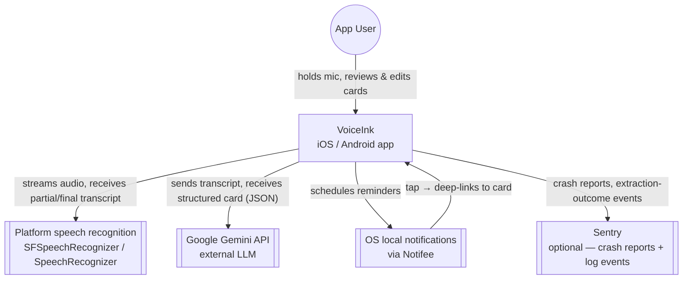
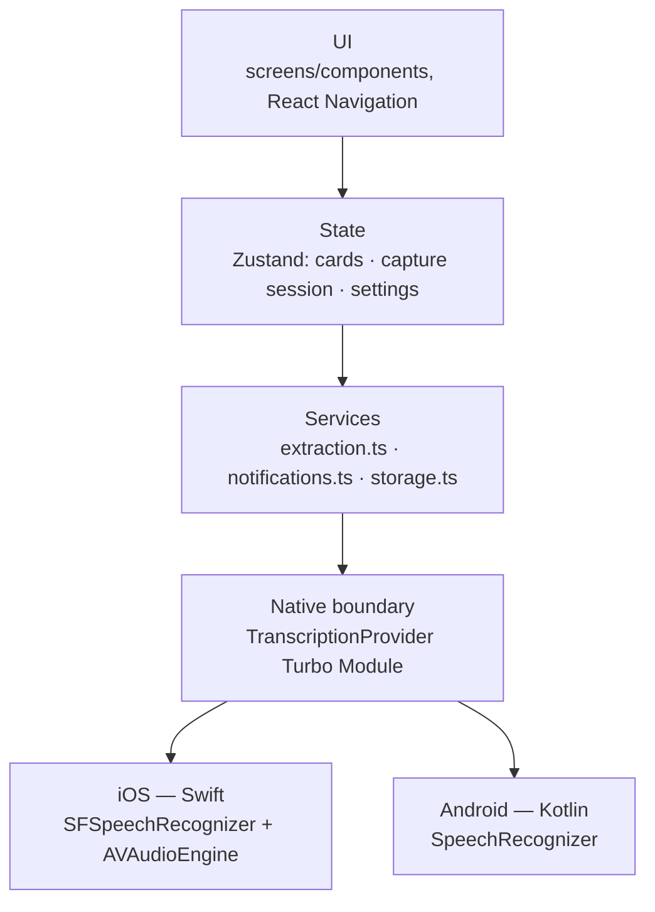
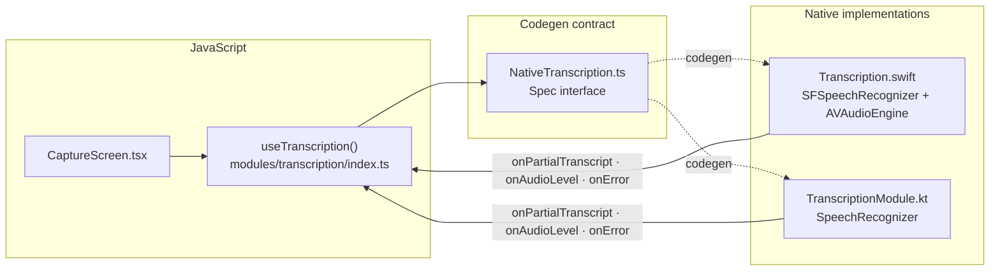

# Architecture

Read at increasing zoom, [C4-model](https://c4model.com/) style: **Context** (VoiceInk and the external systems around it) → **Container** (the major runtime layers inside the app) → **Component** (the Turbo Module's internal shape — the one piece worth zooming into further). Class/interface-level detail (Level 4) isn't diagrammed here; it lives in the source itself and in [native-module-transcription.md](native-module-transcription.md)'s full TS contract — diagramming that level would only add clutter at this codebase's size. See [decisions.md](decisions.md) for why this doc adopts C4 framing instead of a heavier automated-diagram pipeline.

## Level 1 — Context



VoiceInk talks to three external systems, all optional-to-degrade gracefully: speech recognition is a platform API (no model download, no VoiceInk-side account); the Gemini call can fail (network, timeout, malformed output) without losing the recording — `extraction.ts` falls back to saving the raw transcript; Sentry no-ops entirely if `SENTRY_DSN` is unset. Nothing else leaves the device — cards, settings, and the pending-deep-link handoff all live in local MMKV storage.

## Level 2 — Container



Unidirectional flow: native module emits transcription events → capture store updates → UI re-renders. Services are plain TS modules with no React imports; stores call services, components call stores.

**Observability:** `@sentry/react-native` (`src/services/observability.ts`) sits outside this layer diagram, not inside it — crash reporting spans every layer rather than living in one. `initObservability()` runs once at the app root (`App.tsx`, no-ops if `SENTRY_DSN` is unset) and the root component is wrapped in `Sentry.wrap` for automatic JS/native crash capture. `extraction.ts` reports a structured log event (`Sentry.logger`) for each terminal `ExtractionResult` failure (`timeout`/`network`/`invalid-response`, tagged with which model produced it) and for each time the `GEMINI_FALLBACK_MODEL` rate-limit fallback actually fires, so extraction reliability is a real, queryable signal rather than only ever pattern-matched in `ReviewScreen`'s error branch. See [decisions.md](decisions.md) for why Sentry over Firebase/PostHog/Datadog and for the manual (non-wizard) setup details.

## Level 3 — Component: the native boundary

`TranscriptionProvider` is the only hand-written native code, and the one container worth zooming into further — everything above the codegen contract is platform-agnostic. Full spec, including the event payloads and error-code table, in [native-module-transcription.md](native-module-transcription.md).



Design intent mirrors a shared-interface / per-platform-implementation pattern: one TypeScript contract, `SFSpeechRecognizer` behind it on iOS, `SpeechRecognizer` on Android, both emitting the same three events back across the JSI boundary with no bridge serialization.

## State (Zustand)

- `useCardStore` — cards CRUD; hydrates from MMKV at launch, persists on mutation (zustand persist middleware with MMKV storage adapter).
- `useCaptureStore` — ephemeral session: `idle | recording | structuring | error`, partial transcript, final transcript, extraction result. Never persisted.
- `useSettingsStore` — language; persisted.

## Data model

```ts
interface ActionItem { id: string; text: string; dueDate?: string; done: boolean; notificationId?: string }
interface Card {
  id: string; createdAt: string;
  title: string; summary: string; tags: string[];
  actionItems: ActionItem[];
  rawTranscript: string;
  source: 'ai' | 'manual';   // 'manual' = raw-transcript fallback save
}
```

## Extraction service

`services/extraction.ts` sends `{ transcript, today }` to the LLM with a tool definition generated from `cardSchema.ts` (`additionalProperties: false`; `tags` capped at 5; `dueDate` ISO-8601). Handles: timeout (15s), non-conforming output (one retry with error feedback), network failure (surface fallback path). The schema is the single source of truth — review UI renders from the same shape.

## Notifications

`services/notifications.ts` wraps Notifee: request permission on first dated action item, schedule at dueDate (09:00 local if date-only), cancel on item check-off or card delete, deep-link tap → Detail screen for that card.

## Project structure

```
/CLAUDE.md /AGENTS.md /docs
/modules/transcription/{index.ts, NativeTranscription.ts, ios/, android/}
/src
  /screens: Home, Capture, Review, Detail, Settings
  /components: AnimatedPressable.tsx (press-scale wrapper, M6)
  /state: cardStore.ts, captureStore.ts, settingsStore.ts
  /services: extraction.ts, cardSchema.ts, notifications.ts, storage.ts
  /theme: colors.ts, typography.ts, spacing.ts
  /navigation: RootNavigator.tsx, types.ts
```

## Threading notes (why perf stays clean)

Speech recognition and audio run entirely on native threads; only lightweight partial-transcript strings cross into JS via TurboModule events. The LLM call is a plain async fetch. The JS thread does no heavy work, so the UI thread never blocks — same discipline as keeping I/O off the main thread in native apps.
